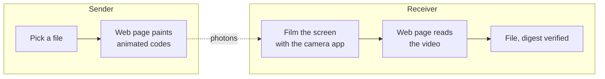

# PhotonProtocol

[](https://github.com/IMNascimento/PhotonProtocol/actions/workflows/ci.yml)
[](#licence)
[](SPEC.md)

**Move a file from one phone to another with nothing but a screen and a
camera.** No network, no cable, no pairing, no Bluetooth, no account, no server.

One device paints the file as a sequence of dense visual codes. The other films
that screen with its ordinary camera app. A decoder reads the recording back
into the original bytes and checks them against a SHA-256 digest.

> *Português: [README.pt-BR.md](README.pt-BR.md)*

---

## How it works



Both pages are static, run entirely on the device, and need no connection after
they have been loaded once. Nothing is uploaded anywhere; there is nowhere to
upload it to.

The channel is **simplex** — the sender never hears back from the receiver, and
cannot know when recording started or which frames survived. So the sender does
not transmit the file once; it transmits an endless stream of
[fountain-coded](https://www.rfc-editor.org/rfc/rfc6330) fragments, any
sufficiently large subset of which reconstructs the whole. Film for as long as
it takes. Frames lost to blur, glare or a shaky hand cost time, never
correctness.

## Status

**Phase 0 of 5.** The specification is a reviewed draft; the codec is not
written yet. The wire format is unstable until [`SPEC.md`](SPEC.md) is tagged
`1.0`, and drafts are not interoperable with each other.

| Phase | Deliverable | State |
| --- | --- | --- |
| 0 | Specification draft, workspace, CI | done |
| 1 | Encoder, decoder and a synthetic channel simulator | next |
| 2 | Bench command line, first decode of real camera footage | |
| 3 | Emitter page | |
| 4 | Decoder page, deployed to GitHub Pages | |
| 5 | Optimisation, driven by phase 1 and 2 measurements | |

No throughput figure is quoted here on purpose. The target is to beat the
state of the art, but the number that goes in this README will be one that was
measured in phase 2, not one that was hoped for in phase 0.

## The format, briefly

[`SPEC.md`](SPEC.md) is the authority; this is orientation.

A frame is a square grid of cells. Each cell carries a **shape** painted in an
**ink colour** — 4 to 6 bits, depending on profile. Around the payload sit the
structures that make the frame readable at all:

| Structure | Purpose |
| --- | --- |
| Four corner finders | locate the code and give the four points a homography needs |
| Orientation tag | resolve the four-fold rotational ambiguity the identical finders leave |
| Timing ring | recover the cell grid and refine registration |
| Calibration ring | a labelled sample of every symbol, **in the same frame** |
| Centre alignment marker | a fifth point, so a bad detection can be caught rather than trusted |
| Two header bands | the frame's own description, carried twice at opposite edges |

The calibration ring is the load-bearing idea. A camera's white balance,
exposure and colour matrix drift continuously and are never told to the sender,
so a decoder must not classify cells against the palette the specification
prints. It classifies them against references it measured in the very frame it
is reading.

Four layers, each depending only on the one below:

| Layer | Carries | Protected by |
| --- | --- | --- |
| Physical | cells | shape and colour separation |
| Link | frames | Reed-Solomon, interleaved, plus a CRC per unit |
| Transport | RaptorQ encoding symbols | the fountain code itself |
| Session | the file | SHA-256, end to end |

Three profiles trade density against robustness. `P2-standard` is the default;
`P1-conservative` spends *more* of its smaller frame on parity, because a
profile is a point on a robustness curve rather than a density dial.

## Repository layout

```
SPEC.md          the protocol — the actual product
core/            photon-core: the protocol, no I/O, no platform
cli/             photon-cli: bench command line, where numbers get measured
wasm/            photon-wasm: WebAssembly bindings, an adapter and nothing more
tools/           independent derivations of every constant in the spec
web-emitter/     the sending page          (phase 3)
web-decoder/     the receiving page        (phase 4)
```

## Building

Requires a stable Rust toolchain. `rust-toolchain.toml` pins the rest.

```bash
cargo test --workspace         # includes the specification's own test vectors
cargo run -p photon-cli -- profiles
```

For the WebAssembly build:

```bash
cargo build -p photon-wasm --target wasm32-unknown-unknown
wasm-pack build wasm --target web
```

The tools that derive the specification's constants need only Node:

```bash
node tools/geometry/frame-geometry.js     # profile tables
node tools/geometry/test-vectors.js       # header, manifest, CRCs
node tools/symbol-design/shape-search.js  # the shape alphabet
```

## Implementing PhotonProtocol elsewhere

This repository is the reference implementation, not the definition. The
definition is [`SPEC.md`](SPEC.md), which fixes every offset, byte order and
scan order, and carries test vectors (§10) so a second implementation can prove
compatibility without reading a line of Rust.

If your implementation disagrees with this one, the specification decides. If
the specification is ambiguous, that is a bug in the specification — please
open an issue.

## Contributing

See [CONTRIBUTING.md](CONTRIBUTING.md). Two rules matter more than the rest:

- **No change to the wire format without updating `SPEC.md` in the same commit.**
- **No optimisation without a benchmark showing the gain.** The open questions in
  `SPEC.md` §12 are open because they should be settled by measurement, and an
  argument is not a measurement.

## Security

The channel is a screen in a room. Anyone who can see it can record it, and
anyone who records it can decode it — that is the whole point of the design.
PhotonProtocol provides **integrity, not confidentiality**. Encrypt anything
sensitive before handing it over.

## Licence

Dual licensed under either of

- Apache License, Version 2.0 ([LICENSE-APACHE](LICENSE-APACHE))
- MIT License ([LICENSE-MIT](LICENSE-MIT))

at your option. Contributions are accepted under the same terms.
