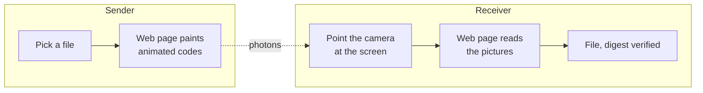

# PhotonProtocol

[](https://github.com/IMNascimento/PhotonProtocol/actions/workflows/ci.yml)
[](#licence)
[](SPEC.md)

**Move a file from one device to another with nothing but a screen and a
camera.** No network, no cable, no pairing, no Bluetooth, no account, no server.

One device paints the file as a sequence of dense visual codes. The other points
its camera at that screen. A decoder reads the pictures back into the original
bytes and checks them against a SHA-256 digest.

> *Português: [README.pt-BR.md](README.pt-BR.md)*

---

## How it works


```mermaid
flowchart LR
    subgraph S [Sender]
        A[Pick a file] --> B[Web page paints<br/>animated codes]
    end
    subgraph R [Receiver]
        C[Point the camera<br/>at the screen] --> D[Web page reads<br/>the pictures]
        D --> E[File, digest verified]
    end
    B -. photons .-> C
```

Both pages are static, run entirely on the device, and need no connection after
they have been loaded once. Nothing is uploaded anywhere; there is nowhere to
upload it to.

The channel is **simplex** — the sender never hears back from the receiver, and
cannot know when recording started or which frames survived. So the sender does
not transmit the file once; it transmits an endless stream of
[fountain-coded](https://www.rfc-editor.org/rfc/rfc6330) fragments, any
sufficiently large subset of which reconstructs the whole. Film for as long as
it takes. Frames lost to blur, glare or a shaky hand cost time, never
correctness.

## Benchmarks

Three kinds of figure, and they are kept apart because they are not worth the
same. [`docs/benchmarks`](docs/benchmarks/README.md) has all of them in full.

**Measured between two real devices.** An iPhone on iOS 18.7, in Safari, held
by hand in front of a 1080p monitor. An 818 KB picture, digest verified.

| Profile | Codes shown a second | Pictures read a second | Throughput |
| --- | --- | --- | --- |
| `P1-conservative` | 10 | 29 | **23.7 KB/s** |
| `P1-conservative` | 20 | 30 | **38.2 KB/s** |
| `P4-balanced`, `P2-standard`, `P3-dense` | 10 | 25 | code found, nothing decoded |

**Simulated, this branch.** `photon film`, a model of a phone camera in front
of a monitor, and the real pages in Chrome with its footage as their camera.

| Profile | Camera | Codes a second | Throughput |
| --- | --- | --- | --- |
| `P1-conservative` | 1080p, 720p from close up | 10 to 20 | 25 to 48 KB/s |
| `P4-balanced` | 1080p, from close up | 10 to 15 | 48 to 72 KB/s |
| `P2-standard` | 4K | 10 | 71 KB/s |
| `P3-dense` | 4K | 10 | 154 KB/s |

Reading a picture takes 15 ms on a desktop core, and took 50.

**Simulated, and on a branch.**
[`experiment/throughput`](https://github.com/IMNascimento/PhotonProtocol/tree/experiment/throughput)
has a second format made of what the phone showed: black and white only, the
shape of the screen, read in tiles, so that a picture taken as the code changes
still yields what it caught.

| Profile | A frame carries | Camera | Codes a second | Throughput |
| --- | --- | --- | --- | --- |
| `D1-swift` | 5040 B | 1080p, on its side | 30 | 150 KB/s |
| `D2-rapid` | 8800 B | 1080p, on its side | 30 to 60 | 260 to 510 KB/s |
| `D3-blaze` | 17952 B | 1080p, on its side, close | 30 to 60 | 360 to 960 KB/s |

| A mebibyte that will not compress | Time | Throughput |
| --- | --- | --- |
| [Decimen](https://github.com/bashalarmistalt/decimen-optical-transfer), a 49-inch monitor to an iPhone 17 Pro Max, **real** | 2.45 s | 418.5 KB/s |
| `D3-blaze`, simulated camera at 30 pictures a second | 2.14 s | 479 KB/s |
| `D3-blaze`, simulated camera at 60 pictures a second | 1.15 s | 888 KB/s |
| `D3-blaze`, the receiving page in Chrome, simulated camera at 30 | 2.2 s | 465 KB/s |
| `D3-blaze`, a real monitor to a real phone | | not yet measured |

Decimen's record is what that branch set out to beat, and the table does not
say it has. Theirs is two devices in a room. Ours is a model, and the model has
flattered before: it said the three denser profiles above read, and the phone
read none of them. The last row is the one that counts, and it is empty.

## How large a file

As large as there is time and memory for. The format itself stops nowhere
near: a file is cut into blocks of RaptorQ symbols, and 200 MB is 11 blocks of
the symbols a dense frame carries.

**Time** is the file divided by the throughput, and a little more.

| | 1 MB | 20 MB | 200 MB |
| --- | --- | --- | --- |
| at 38 KB/s, which a phone has done | 27 s | 9 min | 90 min |
| at 480 KB/s, simulated | 2 s | 43 s | 7 min |
| at 890 KB/s, simulated | 1 s | 23 s | 4 min |

**Memory** is what decides whether a large file arrives at all. Measured with
bytes that will not compress, through the WebAssembly the pages run, in Node,
with no camera in between: every frame that was painted was read.

| File | Format | Preparing to send | Sender's memory | Receiver's memory | |
| --- | --- | --- | --- | --- | --- |
| 20 MB | `P1-conservative` | 1.2 s | 151 MB | 87 MB | same bytes |
| 20 MB | `D3-blaze`, on the branch | 1.7 s | 168 MB | 104 MB | same bytes |
| 50 MB | `D3-blaze` | 4.6 s | 350 MB | 244 MB | same bytes |
| 200 MB | `D3-blaze` | 14 s | 1252 MB | 1010 MB | same bytes, 11126 frames |

The sender needs six to eight times the file and the receiver about five, and
the page holds the file once more on either side to hand it over.

So 200 MB goes through, given a gigabyte and a quarter to send it from and a
gigabyte to receive it in. A desktop has that. A phone's browser gives a page
less than the phone has, and how much less has not been measured: **a file of
200 MB has not been received by a phone, and may well not fit in one.** Both
halves hold the file several times over, which they need not, and that is what
has to change before a phone is asked for files of this size.

## Status

**Try it: [imnascimento.github.io/PhotonProtocol](https://imnascimento.github.io/PhotonProtocol/)**
— open the sender on one device, open the receiver on another and point its
camera at the first. Both pages run entirely on your device.

The wire format is unstable until [`SPEC.md`](SPEC.md) is tagged `1.0`, and
drafts are not interoperable with each other.

| Phase | Deliverable | State |
| --- | --- | --- |
| 0 | Specification draft, workspace, CI | done |
| 1 | Encoder, decoder, frame detection, synthetic channel simulator | done |
| 2 | Bench command line, simulated camera, end-to-end browser tests | done against a **simulated** camera; a real one is next |
| 3 | Sender page | done |
| 4 | Receiver page, reading live from the camera | done |
| 5 | Optimisation, driven by measurements | under way, on [`experiment/throughput`](https://github.com/IMNascimento/PhotonProtocol/tree/experiment/throughput) |

**On a real phone.** An iPhone in Safari, pointed by hand at a 1080p monitor,
received an 818 KB picture with `P1-conservative` at 23.7 KB/s with ten codes
shown a second, and at 38.2 KB/s with twenty. The denser profiles did not
decode on it: the phone's lens moves the middle of the code by up to 0.3 of a
cell relative to its edges, which `P1-conservative` has cells large enough to
shrug off and the others have not.
[`docs/benchmarks`](docs/benchmarks/README.md) has the figures.

**What has been simulated.** Every figure below comes from
`photon film`, which models a phone camera pointed at a monitor — rolling
shutter, the display's own scan-out and pixel response, lens distortion, the
colour filter array, the camera's sharpening and tone curve, 4:2:0 colour —
and from the real pages running in a real browser with that footage as the
camera. It is a model. It reproduced the failure people reported with real
phones, exactly, and what it said of `P1-conservative` the phone then bore
out. What it says of the denser profiles the phone did not: the model bends a
picture less than a real lens does.

| Profile | Camera | Codes a second | Throughput |
| --- | --- | --- | --- |
| `P1-conservative` | 1080p, 720p from close up | 10 to 15 | 25 to 38 KB/s |
| `P4-balanced` | 1080p, from close up | 10 to 15 | 48 to 70 KB/s |
| `P2-standard`, `P3-dense` | 4K | 10 | 70 to 150 KB/s |

End to end, through the receiving page in Chrome slowed to a quarter of desktop
speed to stand in for a phone, a 2.7 MB photograph arrived in 107 seconds with
its digest verified.

[`docs/phase-2-report.md`](docs/phase-2-report.md) has the measurements and
what they changed. The short version: the first decoder never decoded a real
capture, the cause was one decision in the classifier, and it could not have
been found without a camera model harsh enough to reproduce it.
[`docs/phase-1-report.md`](docs/phase-1-report.md) is the earlier report, whose
channel model was too kind to show the fault.

## The format, briefly

[`SPEC.md`](SPEC.md) is the authority; this is orientation.

A frame is a square grid of cells. Each cell carries a **shape** painted in an
**ink colour** — 4 to 6 bits, depending on profile. Around the payload sit the
structures that make the frame readable at all:

| Structure | Purpose |
| --- | --- |
| Four corner finders | locate the code and give the four points a homography needs |
| Orientation tag | resolve the four-fold rotational ambiguity the identical finders leave |
| Timing ring | recover the cell grid and refine registration |
| Calibration ring | a labelled sample of every symbol, **in the same frame** |
| Centre alignment marker | a fifth point, so a bad detection can be caught rather than trusted |
| Two header bands | the frame's own description, carried twice at opposite edges |

The calibration ring is the load-bearing idea. A camera's white balance,
exposure and colour matrix drift continuously and are never told to the sender,
so a decoder must not classify cells against the palette the specification
prints. It classifies them against references it measured in the very frame it
is reading.

Four layers, each depending only on the one below:

| Layer | Carries | Protected by |
| --- | --- | --- |
| Physical | cells | shape and colour separation |
| Link | frames | Reed-Solomon, interleaved, plus a CRC per unit |
| Transport | RaptorQ encoding symbols | the fountain code itself |
| Session | the file | SHA-256, end to end |

Four profiles trade density against robustness. `P1-conservative` is the
default, because the sender cannot see the camera it is being filmed by and a
code too dense for it looks exactly like one that is not. It spends *more* of
its smaller frame on parity, because a profile is a point on a robustness curve
rather than a density dial.

## Repository layout

```
SPEC.md          the protocol — the actual product
core/            photon-core: the protocol, no I/O, no platform
cli/             photon-cli: bench command line, where numbers get measured
wasm/            photon-wasm: WebAssembly bindings, an adapter and nothing more
tools/           independent derivations of every constant, the site build,
                 and the end-to-end tests
web-shared/      landing page and the one stylesheet
web-emitter/     the sending page
web-decoder/     the receiving page
```

## Using it from a desktop

```bash
cargo run --release -p photon-cli -- encode report.pdf --video
# display report-frames/photon.mp4, or the PNGs, on a screen and film it

cargo run --release -p photon-cli -- decode recording.mp4 --out .
```

`decode` prints what happened rather than only whether it worked: how many
frames were located, how many survived, how many were duplicates, and two
throughput figures — one over the whole recording, one over the frames it
actually needed. Reading a directory of extracted frames works too, and needs no
`ffmpeg`. Given the file that was sent (`--truth`), it also counts the cells it
read wrongly, by colour and by region of the frame, which is how a fault is
told from a poor capture.

## Building

Requires a stable Rust toolchain. `rust-toolchain.toml` pins the rest.
`ffmpeg` is needed only for reading and writing video.

```bash
cargo test --workspace         # includes the specification's own test vectors
cargo run -p photon-cli -- profiles
```

For the site:

```bash
wasm-pack build wasm --release --target web --out-dir pkg
node tools/build-site.mjs site
```

## Trying it between a computer and a phone

A browser only offers the camera to a page loaded over HTTPS, so the pages have
to be served that way even on a home network:

```bash
node tools/serve.mjs
```

It prints two addresses. Open the sender on the computer and the receiver on
the phone, which has to be on the same network. Both browsers warn once about
the certificate, which is self-signed; continue past it. With `?capture` in the
address, as printed, both pages report what they measure to the terminal and
the receiver sends the pictures it could not read to `./captures` — which is
what to attach to a bug report.

## Testing without a phone

```bash
cargo build --release -p photon-cli
cd tools/e2e && npm install && cd ../..

# A table of cameras, distances and code rates, and how each went.
node tools/e2e/matrix.mjs photo.jpg

# The real receiving page, in Chrome, with simulated footage as its camera.
target/release/photon film photo.jpg --out filmed --y4m --no-png --seconds 12 --hold 6
node tools/e2e/receive.mjs filmed/camera.y4m photo.jpg --throttle 4

# The real sending page, photographed pixel for pixel and decoded.
node tools/e2e/send.mjs photo.jpg sent
target/release/photon decode sent --truth photo.jpg
```

`--throttle 4` slows the browser to a quarter of its speed, which is roughly a
mid-range phone. `photon bench` times each stage of reading a picture.

The tools that derive the specification's constants need only Node:

```bash
node tools/geometry/frame-geometry.js     # profile tables
node tools/geometry/test-vectors.js       # header, manifest, CRCs
node tools/symbol-design/shape-search.js  # the shape alphabet
```

## Implementing PhotonProtocol elsewhere

This repository is the reference implementation, not the definition. The
definition is [`SPEC.md`](SPEC.md), which fixes every offset, byte order and
scan order, and carries test vectors (§10) so a second implementation can prove
compatibility without reading a line of Rust.

If your implementation disagrees with this one, the specification decides. If
the specification is ambiguous, that is a bug in the specification — please
open an issue.

## Contributing

See [CONTRIBUTING.md](CONTRIBUTING.md). Two rules matter more than the rest:

- **No change to the wire format without updating `SPEC.md` in the same commit.**
- **No optimisation without a benchmark showing the gain.** The open questions in
  `SPEC.md` §12 are open because they should be settled by measurement, and an
  argument is not a measurement.

## Security

The channel is a screen in a room. Anyone who can see it can record it, and
anyone who records it can decode it — that is the whole point of the design.
PhotonProtocol provides **integrity, not confidentiality**. Encrypt anything
sensitive before handing it over.

## Licence

Dual licensed under either of

- Apache License, Version 2.0 ([LICENSE-APACHE](LICENSE-APACHE))
- MIT License ([LICENSE-MIT](LICENSE-MIT))

at your option. Contributions are accepted under the same terms.
