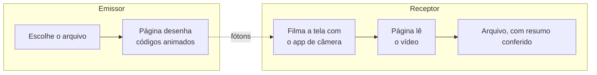

# PhotonProtocol

[](https://github.com/IMNascimento/PhotonProtocol/actions/workflows/ci.yml)
[](#licença)
[](SPEC.md)

**Transfira um arquivo de um celular para outro usando apenas uma tela e uma
câmera.** Sem rede, sem cabo, sem pareamento, sem Bluetooth, sem conta, sem
servidor.

Um aparelho desenha o arquivo como uma sequência de códigos visuais densos. O
outro filma essa tela com o aplicativo de câmera comum. Um decodificador lê a
gravação de volta nos bytes originais e confere tudo contra um resumo SHA-256.

> *English: [README.md](README.md)*

---

## Como funciona



As duas páginas são estáticas, rodam inteiramente no aparelho e não precisam de
conexão depois do primeiro carregamento. Nada é enviado para lugar nenhum;
não existe lugar nenhum para onde enviar.

O canal é **simplex** — o emissor nunca recebe resposta do receptor e não tem
como saber quando a gravação começou nem quais quadros sobreviveram. Por isso
o emissor não transmite o arquivo uma vez; ele transmite um fluxo infinito de
fragmentos codificados por
[fountain code](https://www.rfc-editor.org/rfc/rfc6330), e qualquer
subconjunto grande o bastante reconstrói o todo. Filme pelo tempo que precisar.
Quadros perdidos por borrão, reflexo ou mão trêmula custam tempo, nunca
correção.

## Situação atual

**Fase 1 concluída.** Um arquivo entra por uma ponta e sai pela outra, com
resumo conferido, atravessando um canal sintético distorcido — e o receptor
recebe imagens e encontra o código nelas sozinho. O formato é instável até que
[`SPEC.md`](SPEC.md) receba a tag `1.0`, e rascunhos não são interoperáveis
entre si.

| Fase | Entrega | Estado |
| --- | --- | --- |
| 0 | Rascunho da especificação, workspace, CI | concluída |
| 1 | Codificador, decodificador, detecção de quadro, simulador de canal | concluída |
| 2 | CLI de bancada, primeira decodificação de vídeo real | próxima |
| 3 | Página emissora | |
| 4 | Página decodificadora, publicada no GitHub Pages | |
| 5 | Otimização, guiada pelas medições das fases 1 e 2 | |

Nada foi filmado ainda. Tudo o que foi medido até aqui é contra uma câmera
**modelada**, e a fase 2 é onde esse modelo encontra uma real.

Nenhum número de throughput aparece aqui de propósito. A meta é superar o
estado da arte, mas o número que entrar neste README será um número **medido**
na fase 2, não um número desejado na fase 0.

As primeiras medições estão em
[`docs/phase-1-report.md`](docs/phase-1-report.md), incluindo um resultado
negativo: a margem de confiança do classificador não acompanha o erro o
suficiente para justificar a decodificação por apagamentos.

## O formato, em resumo

[`SPEC.md`](SPEC.md) é a fonte da verdade; isto aqui é só orientação.

Um quadro é uma grade quadrada de células. Cada célula carrega uma **forma**
pintada em uma **cor de tinta** — 4 a 6 bits, conforme o perfil. Ao redor do
payload ficam as estruturas que tornam o quadro legível:

| Estrutura | Para quê |
| --- | --- |
| Quatro marcadores de canto | localizar o código e dar os quatro pontos que uma homografia exige |
| Marca de orientação | resolver a ambiguidade de rotação que os quatro marcadores idênticos deixam |
| Anel de temporização | recuperar a grade de células e refinar o registro |
| Anel de calibração | uma amostra rotulada de cada símbolo, **no mesmo quadro** |
| Marcador central de alinhamento | um quinto ponto, para detectar uma detecção ruim em vez de confiar nela |
| Duas faixas de cabeçalho | a descrição do próprio quadro, carregada duas vezes em bordas opostas |

O anel de calibração é a ideia que sustenta o resto. O balanço de branco, a
exposição e a matriz de cor da câmera variam continuamente e nunca são
informados ao emissor, então o decodificador não pode classificar células
contra a paleta impressa na especificação. Ele classifica contra referências
que mediu no próprio quadro que está lendo.

Quatro camadas, cada uma dependendo apenas da camada abaixo:

| Camada | Carrega | Protegida por |
| --- | --- | --- |
| Física | células | separação de forma e cor |
| Enlace | quadros | Reed-Solomon, com interleaving, e um CRC por unidade |
| Transporte | símbolos RaptorQ | o próprio fountain code |
| Sessão | o arquivo | SHA-256, ponta a ponta |

Três perfis equilibram densidade e robustez. `P2-standard` é o padrão;
`P1-conservative` gasta *mais* do seu quadro menor com paridade, porque um
perfil é um ponto numa curva de robustez, não um botão de densidade.

## Estrutura do repositório

```
SPEC.md          o protocolo — o produto de verdade
core/            photon-core: o protocolo, sem I/O, sem plataforma
cli/             photon-cli: CLI de bancada, onde os números são medidos
wasm/            photon-wasm: bindings WebAssembly, um adaptador e nada mais
tools/           derivações independentes de cada constante da especificação
web-emitter/     a página que envia        (fase 3)
web-decoder/     a página que recebe       (fase 4)
```

## Compilando

Requer um toolchain Rust estável. O `rust-toolchain.toml` cuida do resto.

```bash
cargo test --workspace         # inclui os vetores de teste da especificação
cargo run -p photon-cli -- profiles
```

Para o build WebAssembly:

```bash
cargo build -p photon-wasm --target wasm32-unknown-unknown
wasm-pack build wasm --target web
```

As ferramentas que derivam as constantes da especificação precisam só de Node:

```bash
node tools/geometry/frame-geometry.js     # tabelas de perfil
node tools/geometry/test-vectors.js       # cabeçalho, manifesto, CRCs
node tools/symbol-design/shape-search.js  # o alfabeto de formas
```

## Implementando o PhotonProtocol em outro lugar

Este repositório é a implementação de referência, não a definição. A definição é
o [`SPEC.md`](SPEC.md), que fixa cada offset, ordem de bytes e ordem de
varredura, e traz vetores de teste (§10) para que uma segunda implementação
prove compatibilidade sem ler uma linha de Rust.

Se a sua implementação discordar desta, a especificação decide. Se a
especificação for ambígua, isso é um defeito da especificação — por favor abra
uma issue.

## Contribuindo

Veja [CONTRIBUTING.md](CONTRIBUTING.md). Duas regras valem mais que as outras:

- **Nenhuma mudança de formato sem atualizar o `SPEC.md` no mesmo commit.**
- **Nenhuma otimização sem um benchmark mostrando o ganho.** As questões em
  aberto do `SPEC.md` §12 estão abertas porque devem ser resolvidas por medição,
  e argumento não é medição.

## Segurança

O canal é uma tela numa sala. Quem consegue ver, consegue gravar; quem grava,
consegue decodificar — e isso é o objetivo do projeto, não um descuido. O
PhotonProtocol oferece **integridade, não confidencialidade**. Criptografe
qualquer conteúdo sensível antes de entregá-lo ao protocolo.

## Licença

Licenciado de forma dupla, à sua escolha, sob:

- Apache License, Version 2.0 ([LICENSE-APACHE](LICENSE-APACHE))
- MIT License ([LICENSE-MIT](LICENSE-MIT))

Contribuições são aceitas sob os mesmos termos.
