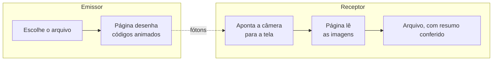

# PhotonProtocol

[](https://github.com/IMNascimento/PhotonProtocol/actions/workflows/ci.yml)
[](#licença)
[](SPEC.md)

**Transfira um arquivo de um aparelho para outro usando apenas uma tela e uma
câmera.** Sem rede, sem cabo, sem pareamento, sem Bluetooth, sem conta, sem
servidor.

Um aparelho desenha o arquivo como uma sequência de códigos visuais densos. O
outro aponta a câmera para essa tela. Um decodificador lê as imagens de volta
nos bytes originais e confere tudo contra um resumo SHA-256.

> *English: [README.md](README.md)*

---

## Como funciona


```mermaid
flowchart LR
    subgraph S [Emissor]
        A[Escolhe o arquivo] --> B[Página desenha<br/>códigos animados]
    end
    subgraph R [Receptor]
        C[Aponta a câmera<br/>para a tela] --> D[Página lê<br/>as imagens]
        D --> E[Arquivo, com resumo conferido]
    end
    B -. fótons .-> C
```

As duas páginas são estáticas, rodam inteiramente no aparelho e não precisam de
conexão depois do primeiro carregamento. Nada é enviado para lugar nenhum;
não existe lugar nenhum para onde enviar.

O canal é **simplex** — o emissor nunca recebe resposta do receptor e não tem
como saber quando a gravação começou nem quais quadros sobreviveram. Por isso
o emissor não transmite o arquivo uma vez; ele transmite um fluxo infinito de
fragmentos codificados por
[fountain code](https://www.rfc-editor.org/rfc/rfc6330), e qualquer
subconjunto grande o bastante reconstrói o todo. Filme pelo tempo que precisar.
Quadros perdidos por borrão, reflexo ou mão trêmula custam tempo, nunca
correção.

## Situação atual

**Teste agora: [imnascimento.github.io/PhotonProtocol](https://imnascimento.github.io/PhotonProtocol/)**
— abra a página emissora num aparelho, abra a receptora em outro e aponte a
câmera dele para o primeiro. Ambas rodam inteiramente no seu aparelho.

O formato é instável até que [`SPEC.md`](SPEC.md) receba a tag `1.0`, e
rascunhos não são interoperáveis entre si.

| Fase | Entrega | Estado |
| --- | --- | --- |
| 0 | Rascunho da especificação, workspace, CI | concluída |
| 1 | Codificador, decodificador, detecção de quadro, simulador de canal | concluída |
| 2 | CLI de bancada, câmera simulada, testes de ponta a ponta no navegador | concluída contra uma câmera **simulada**; a real é o próximo passo |
| 3 | Página emissora | concluída |
| 4 | Página receptora, lendo ao vivo da câmera | concluída |
| 5 | Otimização, guiada por medições | em andamento |

**Num celular de verdade.** Um iPhone no Safari, apontado à mão para um monitor
1080p, recebeu uma imagem de 818 KB com `P1-conservative` a 23,7 KB/s com dez
códigos por segundo na tela, e a 38,2 KB/s com vinte. Os perfis mais densos não
decodificaram nele: a lente do celular desloca o miolo do código em até 0,3 de
célula em relação às bordas, o que o `P1-conservative` tolera por ter células
grandes e os outros não.
[`docs/benchmarks`](docs/benchmarks/README.md) traz os números.

**O que foi simulado.** Todo número abaixo vem do `photon film`,
que modela a câmera de um celular apontada para um monitor — obturador rolante,
a varredura e o tempo de resposta da própria tela, distorção de lente, o filtro
de cor do sensor, a nitidez e a curva de tom que a câmera aplica, cor em 4:2:0
— e das páginas de verdade rodando num navegador de verdade com essa filmagem
no lugar da câmera. É um modelo. Ele reproduziu exatamente a falha relatada com
celulares reais, e o que ele dizia do `P1-conservative` o celular depois
confirmou. O que ele diz dos perfis mais densos o celular não confirmou: o
modelo entorta a imagem menos do que uma lente de verdade.

| Perfil | Câmera | Códigos por segundo | Taxa |
| --- | --- | --- | --- |
| `P1-conservative` | 1080p, ou 720p de perto | 10 a 15 | 25 a 38 KB/s |
| `P4-balanced` | 1080p, de perto | 10 a 15 | 48 a 70 KB/s |
| `P2-standard`, `P3-dense` | 4K | 10 | 70 a 150 KB/s |

De ponta a ponta, pela página receptora no Chrome desacelerado a um quarto da
velocidade do desktop para fazer as vezes de um celular, uma foto de 2,7 MB
chegou em 107 segundos com o resumo conferido.

[`docs/phase-2-report.md`](docs/phase-2-report.md) traz as medições e o que
elas mudaram. Em resumo: o primeiro decodificador nunca leu uma captura real, a
causa era uma única decisão no classificador, e ela não teria sido encontrada
sem um modelo de câmera duro o bastante para reproduzi-la.
[`docs/phase-1-report.md`](docs/phase-1-report.md) é o relatório anterior, cujo
modelo de canal era brando demais para mostrar a falha.

## O formato, em resumo

[`SPEC.md`](SPEC.md) é a fonte da verdade; isto aqui é só orientação.

Um quadro é uma grade quadrada de células. Cada célula carrega uma **forma**
pintada em uma **cor de tinta** — 4 a 6 bits, conforme o perfil. Ao redor do
payload ficam as estruturas que tornam o quadro legível:

| Estrutura | Para quê |
| --- | --- |
| Quatro marcadores de canto | localizar o código e dar os quatro pontos que uma homografia exige |
| Marca de orientação | resolver a ambiguidade de rotação que os quatro marcadores idênticos deixam |
| Anel de temporização | recuperar a grade de células e refinar o registro |
| Anel de calibração | uma amostra rotulada de cada símbolo, **no mesmo quadro** |
| Marcador central de alinhamento | um quinto ponto, para detectar uma detecção ruim em vez de confiar nela |
| Duas faixas de cabeçalho | a descrição do próprio quadro, carregada duas vezes em bordas opostas |

O anel de calibração é a ideia que sustenta o resto. O balanço de branco, a
exposição e a matriz de cor da câmera variam continuamente e nunca são
informados ao emissor, então o decodificador não pode classificar células
contra a paleta impressa na especificação. Ele classifica contra referências
que mediu no próprio quadro que está lendo.

Quatro camadas, cada uma dependendo apenas da camada abaixo:

| Camada | Carrega | Protegida por |
| --- | --- | --- |
| Física | células | separação de forma e cor |
| Enlace | quadros | Reed-Solomon, com interleaving, e um CRC por unidade |
| Transporte | símbolos RaptorQ | o próprio fountain code |
| Sessão | o arquivo | SHA-256, ponta a ponta |

Quatro perfis equilibram densidade e robustez. `P1-conservative` é o padrão,
porque o emissor não enxerga a câmera que o está filmando, e um código denso
demais para ela tem exatamente a mesma cara de um que não é. Ele gasta *mais* do
seu quadro menor com paridade, porque um perfil é um ponto numa curva de
robustez, não um botão de densidade.

## Estrutura do repositório

```
SPEC.md          o protocolo — o produto de verdade
core/            photon-core: o protocolo, sem I/O, sem plataforma
cli/             photon-cli: CLI de bancada, onde os números são medidos
wasm/            photon-wasm: bindings WebAssembly, um adaptador e nada mais
tools/           derivações independentes de cada constante, o build do site
                 e os testes de ponta a ponta
web-shared/      página inicial e a folha de estilo única
web-emitter/     a página que envia
web-decoder/     a página que recebe
```

## Usando pelo desktop

```bash
cargo run --release -p photon-cli -- encode relatorio.pdf --video
# exiba relatorio-frames/photon.mp4, ou os PNGs, numa tela e filme

cargo run --release -p photon-cli -- decode gravacao.mp4 --out .
```

O `decode` imprime o que aconteceu, não apenas se funcionou: quantos quadros
foram localizados, quantos sobreviveram, quantos eram duplicados, e dois
números de throughput — um sobre a gravação inteira, outro sobre os quadros de
que realmente precisou. Também lê um diretório de quadros extraídos, sem
precisar de `ffmpeg`. Recebendo o arquivo que foi enviado (`--truth`), ele
conta ainda as células que leu errado, por cor e por região do quadro — que é
como se distingue um defeito de uma captura ruim.

## Compilando

Requer um toolchain Rust estável. O `rust-toolchain.toml` cuida do resto.
O `ffmpeg` só é necessário para ler e escrever vídeo.

```bash
cargo test --workspace         # inclui os vetores de teste da especificação
cargo run -p photon-cli -- profiles
```

Para o site:

```bash
wasm-pack build wasm --release --target web --out-dir pkg
node tools/build-site.mjs site
```

## Testando entre um computador e um celular

O navegador só libera a câmera para páginas abertas por HTTPS, então as
páginas precisam ser servidas assim mesmo numa rede doméstica:

```bash
node tools/serve.mjs
```

Ele imprime dois endereços. Abra o emissor no computador e o receptor no
celular, que precisa estar na mesma rede. Os dois navegadores avisam uma vez
sobre o certificado, que é autoassinado; escolha continuar. Com `?capture` no
endereço, como impresso, as duas páginas relatam no terminal o que estão
medindo, e o receptor envia para `./captures` as imagens que não conseguiu ler
— que é o que se anexa a um relato de problema.

## Testando sem celular

```bash
cargo build --release -p photon-cli
cd tools/e2e && npm install && cd ../..

# Uma tabela de câmeras, distâncias e taxas de código, e como cada uma se saiu.
node tools/e2e/matrix.mjs foto.jpg

# A página receptora de verdade, no Chrome, com filmagem simulada como câmera.
target/release/photon film foto.jpg --out filmado --y4m --no-png --seconds 12 --hold 6
node tools/e2e/receive.mjs filmado/camera.y4m foto.jpg --throttle 4

# A página emissora de verdade, fotografada pixel a pixel e decodificada.
node tools/e2e/send.mjs foto.jpg enviado
target/release/photon decode enviado --truth foto.jpg
```

`--throttle 4` desacelera o navegador a um quarto da velocidade, que é mais ou
menos um celular intermediário. O `photon bench` cronometra cada etapa da
leitura de uma imagem.

As ferramentas que derivam as constantes da especificação precisam só de Node:

```bash
node tools/geometry/frame-geometry.js     # tabelas de perfil
node tools/geometry/test-vectors.js       # cabeçalho, manifesto, CRCs
node tools/symbol-design/shape-search.js  # o alfabeto de formas
```

## Implementando o PhotonProtocol em outro lugar

Este repositório é a implementação de referência, não a definição. A definição é
o [`SPEC.md`](SPEC.md), que fixa cada offset, ordem de bytes e ordem de
varredura, e traz vetores de teste (§10) para que uma segunda implementação
prove compatibilidade sem ler uma linha de Rust.

Se a sua implementação discordar desta, a especificação decide. Se a
especificação for ambígua, isso é um defeito da especificação — por favor abra
uma issue.

## Contribuindo

Veja [CONTRIBUTING.md](CONTRIBUTING.md). Duas regras valem mais que as outras:

- **Nenhuma mudança de formato sem atualizar o `SPEC.md` no mesmo commit.**
- **Nenhuma otimização sem um benchmark mostrando o ganho.** As questões em
  aberto do `SPEC.md` §12 estão abertas porque devem ser resolvidas por medição,
  e argumento não é medição.

## Segurança

O canal é uma tela numa sala. Quem consegue ver, consegue gravar; quem grava,
consegue decodificar — e isso é o objetivo do projeto, não um descuido. O
PhotonProtocol oferece **integridade, não confidencialidade**. Criptografe
qualquer conteúdo sensível antes de entregá-lo ao protocolo.

## Licença

Licenciado de forma dupla, à sua escolha, sob:

- Apache License, Version 2.0 ([LICENSE-APACHE](LICENSE-APACHE))
- MIT License ([LICENSE-MIT](LICENSE-MIT))

Contribuições são aceitas sob os mesmos termos.
